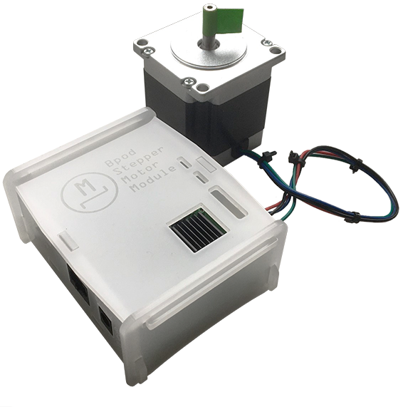

# Bpod Stepper Module

The *Bpod Stepper Module* enables virtually noiseless operation of a stepper motor by combining smooth acceleration profiles with a *SilentStepStick* driver. You can use it either as a module for *Bpod state machine r2* or as a stand-alone USB device.

## Wiki

Please refer to [**the wiki**](../../wiki) for documentation.

## Credits ##

* Concept & firmware by Florian Rau and Josh Sanders
* PCB layout by Christopher Schultz, Josh Sanders and Florian Rau
* PCB layout partially based on:
  * [Bpod Teensy Shield](https://github.com/sanworks/Bpod-CAD/tree/master/PCB/Modules/Gen2/Bpod%20Teensy%20Shield) by Sanworks ([GPL v3](https://www.gnu.org/licenses/gpl-3.0.en.html))
  * [SilentStepStick Protector](https://github.com/watterott/SilentStepStick) by Watterott ([CC BY-SA 4.0](https://creativecommons.org/licenses/by-sa/4.0/))
* Library dependencies:
  * [ArCOM](https://github.com/bimac/ArCOM) by Sanworks ([GPL v3](https://www.gnu.org/licenses/gpl-3.0.en.html))
  * [TeensyStep](https://github.com/luni64/TeensyStep) by luni64 ([MIT](https://opensource.org/licenses/MIT))
  * [TMCStepper](https://github.com/teemuatlut/TMCStepper) by teemuatlut ([MIT](https://opensource.org/licenses/MIT))
  * [Teensy3x_QuadDecode](https://github.com/bimac/Teensy3x_QuadDecode.git) by TLB ([MIT](https://opensource.org/licenses/MIT))
