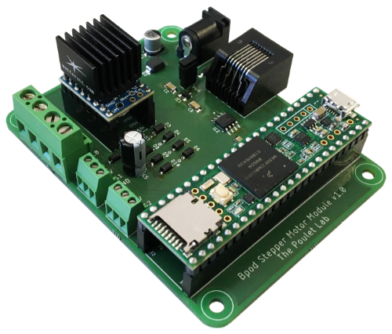

# Bpod Stepper Motor Module

Combining smooth acceleration profiles with a _SilentStepStick_ driver, the _Bpod Stepper Motor Module_ allows for virtually noiseless operation of a stepper motor - either as a module for _Bpod state machine r2_ or as a stand-alone USB device.

## Serial Command Interface
* **68 / ASCII 'D': move by a defined angle** (degrees)  
  Must be followed by:

  * **Int16:** angle (degrees).

  Positive numbers will result in clockwise, negative numbers in counter-clockwise rotation.  
  Returned events: 1 = movement start, 2 = movement end.

* **83 / ASCII 'S': move to relative position** (steps)  
  Must be followed by:

  * **Int16:** number of steps.

  Positive numbers will result in clockwise, negative numbers in counter-clockwise rotation.  
  Returned events: 1 = movement start, 2 = movement end.

* **80 / ASCII 'P': move to absolute position** (steps)  
  Must be followed by:

  * **Int16:** absolute position (steps).

  Returned events: 1 = movement start, 2 = movement end.

* **90 / ASCII 'Z': reset absolute position to zero**

* **76 / ASCII 'L': search limit switch**  
  Must be followed by:

  * **uInt8:** specifies the movement direction (0 = CCW, 1 = CW).

  This will advance the motor until one of the limit switches has been reached.  
  Returned events: 3 = limit switch reached.

* **65 / ASCII 'A': set acceleration** (steps / s2)  
  Must be followed by:

  * **Int16:** acceleration (steps / s2).

* **86 / ASCII 'V': set maximum velocity** (steps / s)  
  Must be followed by:

  * **Int16:** velocity (steps / s).

* **71 / ASCII 'G': get parameter**  
  Must be followed by one of the following bytes:

  * **65 / ASCII 'A':** get absolute position (steps)  
    Returns one Int16.  
  * **65 / ASCII 'A':** get acceleration (steps / s2)  
    Returns one Int16.
  * **86 / ASCII 'V':** get maximum velocity (steps / s)  
    Returns one Int16.
  * **82 / ASCII 'R':** get steps per revolution  
    Returns one uInt32.
    
* **Byte 212: USB Handshake** (reserved)

* **Byte 255: return module info** (reserved)

## Bill of Materials
| Item     | Vendor   | Qty | Part Number                                                                                     | Description                 |
| :------- | :------  | :-: | :---------------------------------------------------------------------------------------------- | :-------------------------  |
| IC1      | Digi-Key |  1  | [LM3480IM3-5.0/NOPBCT-ND](https://www.digikey.com/products/en?keywords=LM3480IM3-5.0/NOPBCT-ND) | 5V regulator                |
| IC2      | Digi-Key |  1  | [ADM3077EARZ-ND](https://www.digikey.com/products/en?keywords=ADM3077EARZ-ND)                   | RS-485 IC                   |
| C1, C5   | Digi-Key |  2  | [PCE3203TR-ND](https://www.digikey.com/products/en?keywords=PCE3203TR-ND)                       | Aluminium capacitor, 100 µF |
| C2 - C4  | Digi-Key |  3  | [311-1179-1-ND](https://www.digikey.com/products/en?keywords=311-1179-1-ND)                     | Ceramic capacitor, 0.1 µf   |
| D1       | Digi-Key |  1  | [MBR0520LCT-ND](https://www.digikey.com/products/en?keywords=MBR0520LCT-ND)                     | Schottky diode, 20V 500mA   |
| D2       | Digi-Key |  1  | [1KSMB75CACT-ND](https://www.digikey.com/products/en?keywords=1KSMB75CACT-ND)                   | TVS diode                   |
| D3 - D11 | Digi-Key |  9  | [S310FACT-ND](https://www.digikey.com/products/en?keywords=S310FACT-ND)                         | Schottky diode, 100V 3A     |
|          | Digi-Key |  1  | [A31442-ND](https://www.digikey.com/products/en?keywords=A31442-ND)                             | Ethernet jack               |
|          | Digi-Key |  1  | [839-1512-ND](https://www.digikey.com/products/en?keywords=839-1512-ND)                         | DC barrel jack              |
|          | Digi-Key |  1  | [S9001-ND](https://www.digikey.com/products/en?keywords=S9001-ND)                               | Jumper                      |
|          | Digi-Key |  1  | [S1011EC-02-ND](https://www.digikey.com/products/en?keywords=S1011EC-02-ND)                     | Male header, 1x2            |
|          | Digi-Key |  2  | [PPPC081LFBN-RC](https://www.digikey.com/products/en?keywords=PPPC081LFBN-RC)                   | Female header, 1x8          |
|          | Digi-Key |  2  | [PPPC241LFBN-RC](https://www.digikey.com/products/en?keywords=PPPC241LFBN-RC)                   | Female header, 1x24         |
|          | Digi-Key |  1  | [1568-1465-ND](https://www.digikey.com/products/en?keywords=1568-1465-ND)                       | Teensy 3.6                  |
|          | Digi-Key |  1  | [2100-20150007-002-ND](https://www.digikey.com/products/en?keywords=2100-20150007-002-ND)       | Stepper motor driver        |
|          | Digi-Key |  1  | [2100-201835-ND](https://www.digikey.com/products/en?keywords=2100-201835-ND)                   | Heat sink                   |
|          | Digi-Key |  2  | [A98334-ND](https://www.digikey.com/products/en?keywords=A98334-ND)                             | Terminal block, 1x3         |
|          | Digi-Key |  1  | [A98081-ND](https://www.digikey.com/products/en?keywords=A98081-ND)                             | Terminal block, 1x4         |

## Credits ##

* Concept & firmware by Florian Rau
* PCB layout by Christopher Schultz and Florian Rau
* PCB layout partially based on:
  * [Bpod Teensy Shield](https://github.com/sanworks/Bpod-CAD/tree/master/PCB/Modules/Gen2/Bpod%20Teensy%20Shield) by Sanworks ([GPL v3](https://www.gnu.org/licenses/gpl-3.0.en.html))
  * [SilentStepStick Protector](https://github.com/watterott/SilentStepStick) by Watterott ([CC BY-SA 4.0](https://creativecommons.org/licenses/by-sa/4.0/))
* Firmare uses the following libraries:
  * [ArCOM](https://github.com/sanworks/ArCOM) by Sanworks ([GPL v3](https://www.gnu.org/licenses/gpl-3.0.en.html))
  * [SmoothStepper](https://github.com/bimac/SmoothStepper) by Florian Rau ([GPL v3](https://www.gnu.org/licenses/gpl-3.0.en.html))
