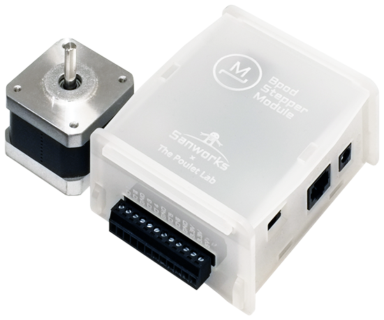

# Bpod Stepper Module

Combining smooth acceleration profiles with a _SilentStepStick_ driver, the _Bpod Stepper Module_ allows for virtually noiseless operation of a stepper motor - either as a module for _Bpod state machine r2_ or as a stand-alone USB device.

## Serial Command Interface
| Send                          | Receive | Unit / Key                               | Description                                                                                                           |
| :---------------------------- | :-----  | :--------------------------------------- | :-------------------------------------------------------------------------------------------------------------------- |
| ```S``` + Int16               |         | steps                                    | Move to relative position. Positive numbers will result in clockwise, negative numbers in counter-clockwise rotation. |
| ```P``` + Int16               |         | steps                                    | Move to absolute position.                                                                                            |
| n                             |         | n = 0, 1 … 9                             | Move to predefined target position.                                                                                   |
| ```Z```                       |         |                                          | Set absolute position back to zero.                                                                                   |
| ```L``` + uInt8               |         | 0&nbsp;=&nbsp;CCW,&nbsp;1&nbsp;=&nbsp;CW | Search limit switch. Move until one of the limit switches has been reached.                                           |
| ```V``` + uInt16              |         | steps / s                                | Set maximum velocity                                                                                                  |
| ```A``` + uInt16              |         | steps / s<sup>2</sup>                    | Set acceleration.                                                                                                     |
| ```I``` + uInt16              |         | mA                                       | Set RMS current                                                                                                       |
| ```T```n&nbsp;+&nbsp;Int32    |         | n = 0, 1 … 9                             | Set predefined target position                                                                                        |
| ```M``` + uInt8 + uInt8       |         |                                          | Set input mode of IO port                                                                                             |
| ```R``` + uInt8 + uInt8       |         |                                          | Set input resistor of IO port: 0 = none; 1 = pullup; 2 = pulldown                                                     |
| ```G```n                      | Int32   | n = 0, 1 … 9                             | Get predefined target position                                                                                        |
| ```GP```                      | Int16   | steps                                    | Get absolute position                                                                                                 |
| ```GV```                      | uInt16  | steps / s                                | Get maximum velocity                                                                                                  |
| ```GA```                      | uInt16  | steps / s<sup>2</sup>                    | Get acceleration                                                                                                      |
| ```GI```                      | uInt16  | mA                                       | Get RMS current                                                                                                       |
| ```GR``` + uInt8              | uInt8   |                                          | Get input resistor of IO port: 0 = none; 1 = pullup; 2 = pulldown                                                     |
| ```GH```                      | uInt8   |                                          | Get hardware revision                                                                                                 |
| ```GT```                      | uInt8   |                                          | Get bool: TMC5160 found?                                                                                              |
| Byte 212                      |         |                                          | USB Handshake (reserved)                                                                                              |
| Byte 255                      |         |                                          | Return module info (reserved)                                                                                         |

## Bill of Materials
| Item     | Vendor    | Qty | Part Number                                                                                      | Description                 |
| :------- | :-------- | :-: | :----------------------------------------------------------------------------------------------- | :-------------------------- |
| C1, C2   | Digi-Key  |  2  | [1189-3780-1-ND](https://www.digikey.com/en/products?keywords=1189-3780-1-ND)                    | Aluminium capacitor, 100 µF |
| C3, C4   | Digi-Key  |  2  | [PCE4362CT-ND](https://www.digikey.com/en/products?keywords=PCE4362CT-ND)                        | Aluminium capacitor, 2.2 µF |
| C5 - C8  | Digi-Key  |  4  | [311-1179-1-ND](https://www.digikey.com/en/products?keywords=311-1179-1-ND)                      | Ceramic capacitor, 0.1 µf   |
| D1       | Digi-Key  |  1  | [1KSMB75CACT-ND](https://www.digikey.com/en/products?keywords=1KSMB75CACT-ND)                    | TVS diode                   |
| D2 - D3  | Digi-Key  |  2  | [SBR80520LT1G](https://www.digikey.com/en/products?keywords=SBR80520LT1G)                        | Schottky diode, 20V 500mA   |
| D4 - D12 | Digi-Key  |  9  | [SS310LWHRVGCT-ND](https://www.digikey.com/en/products?keywords=SS310LWHRVGCT-ND)                | Schottky diode, 100V 3A     |
| IC1      | Digi-Key  |  1  | [LM3480IM3-5.0/NOPBCT-ND](https://octopart.com/lm3480im3-5.0%2Fnopb-texas+instruments-24813903)  | 5V regulator                |
| IC2      | Digi-Key  |  1  | [ADM3077EARZ-ND](https://www.digikey.com/en/products?keywords=ADM3077EARZ-ND)                    | RS-485 IC                   |
| IC3      | Digi-Key  |  1  | [MCP1792T-5002H/CB](https://www.digikey.com/en/products?keywords=MCP1792T-5002H/CB)              | 5V regulator                |
| IC4      | Digi-Key  |  1  | [MCP1793T-3302H/DC](https://www.digikey.com/en/products?keywords=MCP1793T-3302H/DC)              | 3.3V regulator              |
|          | Digi-Key  |  1  | [A31442-ND](https://www.digikey.com/en/products?keywords=A31442-ND)                              | Ethernet jack               |
|          | Digi-Key  |  1  | [839-1512-ND](https://www.digikey.com/en/products?keywords=839-1512-ND)                          | DC barrel jack              |
|          | Digi-Key  |  1  | [PPTC021LFBN-RC](https://www.digikey.com/en/products?keywords=PPTC021LFBN-RC)                    | Female header, 1x2          |
|          | Digi-Key  |  2  | [PPPC081LFBN-RC](https://www.digikey.com/en/products?keywords=PPPC081LFBN-RC)                    | Female header, 1x8          |
|          | Digi-Key  |  2  | [PPPC241LFBN-RC](https://www.digikey.com/en/products?keywords=PPPC241LFBN-RC)                    | Female header, 1x24         |
|          | Digi-Key  |  1  | [1568-1464-ND](https://www.digikey.com/en/products?keywords=1568-1464-ND)                        | Teensy 3.5                  |
|          | Digi-Key  |  1  | [WM21887-ND](https://www.digikey.com/en/products?keywords=WM21887-ND)                            | Terminal Block Header, 1x4  |
|          | Digi-Key  |  1  | [WM7780-ND](https://www.digikey.com/en/products?keywords=WM7780-ND)                              | Terminal Block Header, 1x12 |
|          | Digi-Key  |  1  | [WM7791-ND](https://www.digikey.com/en/products?keywords=WM7791-ND)                              | Terminal Block Plug, 1x4    |
|          | Digi-Key  |  1  | [WM7742-ND](https://www.digikey.com/en/products?keywords=WM7742-ND)                              | Terminal Block Plug, 1x12   |
|          | Watterott |  1  | [201899-001](https://shop.watterott.com/SilentStepStick-TMC5160-Stepper-motor-driver-10-35V-V15) | Stepper motor driver        |


## Credits ##


* Concept & firmware by Florian Rau
* PCB layout by Christopher Schultz and Florian Rau
* PCB layout partially based on:
  * [Bpod Teensy Shield](https://github.com/sanworks/Bpod-CAD/tree/master/PCB/Modules/Gen2/Bpod%20Teensy%20Shield) by Sanworks ([GPL v3](https://www.gnu.org/licenses/gpl-3.0.en.html))
  * [SilentStepStick Protector](https://github.com/watterott/SilentStepStick) by Watterott ([CC BY-SA 4.0](https://creativecommons.org/licenses/by-sa/4.0/))
* Firmare uses the following libraries:
  * [ArCOM](https://github.com/sanworks/ArCOM) by Sanworks ([GPL v3](https://www.gnu.org/licenses/gpl-3.0.en.html))
  * [SmoothStepper](https://github.com/bimac/SmoothStepper) by Florian Rau ([GPL v3](https://www.gnu.org/licenses/gpl-3.0.en.html))
  * [TMCStepper](https://github.com/teemuatlut/TMCStepper) ([MIT](https://opensource.org/licenses/MIT))
